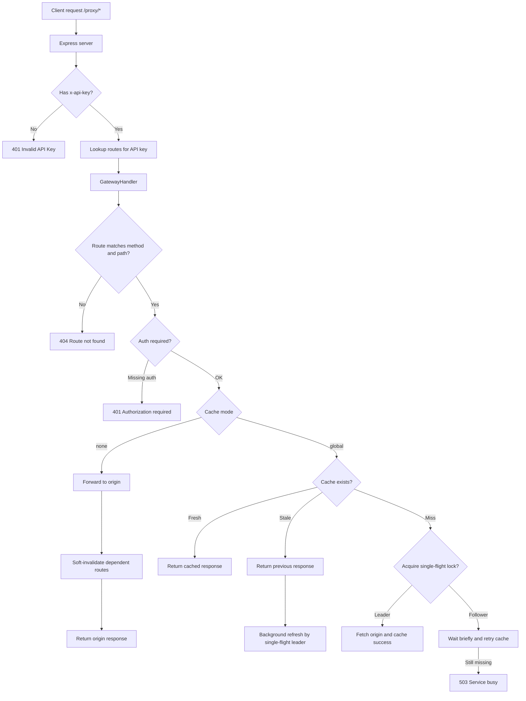
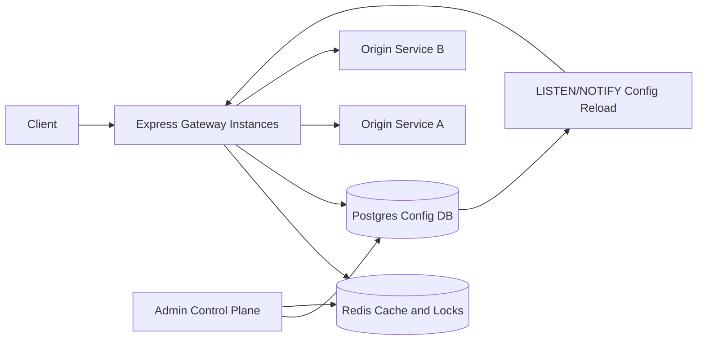

# Whooper API Engine Architecture

## Purpose

Whooper API Engine is intended to be a configurable API gateway that sits in front of one or more origin services. It receives client requests through a common `/proxy/*` entry point, validates that the caller's API key is allowed to access the requested route, optionally checks request authentication, proxies traffic to the configured origin, and caches eligible responses in Redis.

The current codebase is an early implementation of that design. The core caching, single-flight, proxy, Redis, and route-handling concepts are present, while the server wiring and dynamic configuration loader are still incomplete.

## High-Level Behavior

At a high level, the engine is designed to do the following:

1. Start an Express server.
2. Connect to Postgres through Drizzle and `node-postgres`.
3. Connect to Redis through `ioredis`.
4. Load gateway route configuration from Postgres into memory.
5. Listen for Postgres `LISTEN/NOTIFY` events to reload configuration when routes change.
6. Intercept all incoming requests under `/proxy/*`.
7. Resolve the caller's `x-api-key` to a project-specific route list.
8. Match the incoming method and cleaned path against configured route matchers.
9. Enforce lightweight gateway-level auth requirements.
10. Serve cached responses where possible.
11. Forward cache misses and uncached routes to the origin service.
12. Soft-invalidate dependent cached routes after write-like routes run.

## Current Runtime Entry Point

`apps/engine/server.ts` is the engine process entry point. It currently:

- Loads environment variables with `dotenv`.
- Creates an Express app.
- Enables JSON request parsing.
- Checks the Drizzle/Postgres connection.
- Creates a Redis client.
- Registers a catch-all route for `/proxy/*`.
- Checks for the presence of an `x-api-key` header.
- Starts listening on `process.env.ENGINE_PORT`, with the older `PORT` variable still supported as a fallback.

The current server does not yet instantiate or call `GatewayHandler`, `CacheService`, `SingleFlight`, `OriginProxy`, `loadConfig`, or `startConfigListener`. This means the implemented gateway logic exists, but incoming requests are not yet passed into that logic.

## Main Components

### Express Server

File: `apps/engine/server.ts`

The server owns process startup and HTTP request interception. The intended design is a single gateway endpoint rather than manually registering every upstream route in Express. This is the right direction for a database-configured gateway because route behavior can be changed through stored config rather than code deployments.

Current gap: after validating `x-api-key`, the route handler stops and does not send a response or delegate to `GatewayHandler`.

### Gateway Handler

File: `apps/engine/gateway/handler.ts`

`GatewayHandler` contains the main request orchestration logic:

- Removes the `/proxy` prefix from incoming paths.
- Finds a matching `RouteConfig` by HTTP method and path matcher.
- Checks whether auth is required.
- Builds a Redis cache key from `routeId` and an MD5 hash of the cleaned path.
- Handles uncached routes.
- Handles cache hits.
- Handles stale cache entries.
- Uses single-flight locking to prevent cache stampedes.
- Calls the origin proxy when data must be fetched.
- Triggers soft invalidation after uncached/write routes run.

The handler currently treats auth as a presence check for `Authorization` or `Cookie` when `route.authType === "jwt"`. It does not validate JWT signatures, claims, expiry, issuer, audience, scopes, or permissions.

### Cache Service

File: `apps/engine/cache/cache.service.ts`

`CacheService` is a small Redis-backed cache abstraction. It stores values as JSON with this shape:

```ts
{
  current: string | null;
  prev: string | null;
  invalidated: boolean;
}
```

This shape supports stale-while-revalidate behavior:

- `current` is the latest fresh response body.
- `prev` is the previous response body.
- `invalidated` marks a value as stale while still allowing the gateway to serve the previous response.

The cache service supports:

- `getRaw`: read and parse the full cache object.
- `get`: return the best available body from `current` or `prev`.
- `set`: store a new fresh body and preserve the older body as `prev`.
- `softInvalidateByRoute`: scan keys for a route prefix and convert fresh values into stale values.

Current limitation: invalidation scans Redis by prefix, which is simple but can become expensive as the number of keys grows.

### Single Flight

File: `apps/engine/cache/singleFlight.ts`

`SingleFlight` prevents multiple concurrent requests for the same uncached or invalidated resource from hitting the origin at the same time. It uses Redis `SET key value NX EX ttl` through `RedisClient.setNX`.

The first request to acquire the lock becomes the leader and fetches from origin. Follower requests wait briefly and then try to read the cache.

Current limitation: the lock has a fixed 5 second TTL and there is no explicit lock release. This avoids deadlocks, but long origin requests may outlive the lock and allow duplicate leaders.

### Redis Client

File: `apps/engine/redis/client.ts`

`RedisClient` wraps the subset of `ioredis` operations used by the gateway:

- `get`
- `set` with TTL
- `del`
- `scanByPrefix`
- `setNX` for distributed locks

It uses `enableReadyCheck: false`, which may help in some managed Redis environments but means startup health should be handled explicitly elsewhere.

### Origin Proxy

File: `apps/engine/proxy/origin.proxy.ts`

`OriginProxy` forwards requests to `origin + path` using `node-fetch` and returns the origin status plus response body as text.

Current limitations:

- Request bodies are passed directly as `req.body`, which is an object after `express.json()`. `node-fetch` expects a valid body type such as string, Buffer, stream, or URLSearchParams. JSON bodies likely need `JSON.stringify(req.body)` plus a content type.
- It forwards all incoming headers, including gateway-specific headers like `x-api-key` and possibly `host`.
- It does not preserve origin response headers.
- It does not support streaming responses.
- It does not explicitly handle query strings.

### Configuration Types

File: `apps/engine/config/types.ts`

The gateway config model is centered on `RouteConfig`:

```ts
interface RouteConfig {
  routeId: string;
  method: string;
  matcher: MatchFunction<any>;
  origin: string;
  ttl: number;
  authType: "none" | "jwt";
  cacheMode: "none" | "global";
  invalidates: InvalidationRule[];
}
```

This implies each route has:

- A stable route ID.
- An HTTP method.
- A compiled path matcher.
- An origin base URL.
- A cache TTL.
- An auth requirement.
- A cache mode.
- A list of other routes it invalidates.

### Database Access

Files: `apps/engine/db/drizzle.ts`, `apps/engine/db/queries.ts`, `apps/engine/db/listen.ts`

The database layer currently defines:

- A Drizzle connection using `DB_URL`.
- SQL for reading projects and routes.
- A Postgres listener for `gateway_config_changed`.

The listener calls `loadConfig()` and passes the new map to an `onReload` callback.

Current gap: `apps/engine/config/loader.ts` is not implemented, so the system cannot currently build the in-memory API-key-to-routes map.

## Intended Request Flow



## Cache Flow Details

### Cache Hit

When a non-invalidated cache entry exists, the gateway returns `current` if available, otherwise `prev`. It sets:

```http
X-Cache: HIT
```

### Soft-Invalidated Hit

When a cache entry exists but `invalidated` is true, the gateway:

- Attempts to acquire the single-flight lock.
- If it becomes leader, starts a background refresh.
- Immediately returns the stale `prev` value.
- Sets:

```http
X-Cache: STALE
```

This gives low latency to clients while refreshing popular stale data in the background.

### Cache Miss

When no cache entry exists:

- The leader fetches the origin and stores successful 2xx responses.
- Followers wait `300ms`, then retry the cache.
- If the cache is still empty, followers receive `503 Service busy`.

Leader responses set:

```http
X-Cache: MISS
```

Follower responses from a newly populated cache set:

```http
X-Cache: PREV
```

## Invalidation Model

Invalidation is route-based. A route can declare that it invalidates one or more target route IDs. This is useful for write routes such as:

- `POST /products`
- `PUT /products/:id`
- `DELETE /products/:id`

Those write routes can soft-invalidate read routes such as:

- `GET /products`
- `GET /products/:id`

The cache is not deleted immediately. Instead, existing entries are marked invalidated and their previous value is preserved. This avoids a thundering herd immediately after writes and lets the gateway continue serving stale data while refresh happens.

## Current Completion State

Implemented:

- Express startup shell.
- Drizzle/Postgres connection.
- Redis wrapper.
- Cache value storage.
- Soft invalidation by route prefix.
- Single-flight leader election.
- Origin proxy skeleton.
- Gateway request orchestration logic.
- Postgres notification listener skeleton.
- SQL query definitions for projects and routes.

Incomplete or not wired:

- `loadConfig()` does not load routes from Postgres.
- `apps/engine/server.ts` does not keep an in-memory config map.
- `apps/engine/server.ts` does not start the Postgres config listener.
- `apps/engine/server.ts` does not instantiate `CacheService`, `SingleFlight`, `OriginProxy`, or `GatewayHandler`.
- `/proxy/*` does not call the handler after checking `x-api-key`.
- Route path strings are not compiled into `path-to-regexp` matchers anywhere yet.
- Invalidation rules are not loaded from the database.
- JWT auth is not actually validated.
- Query strings are not included in cache keys or origin forwarding.
- Request and response headers are not handled carefully.
- Build verification could not run in this workspace because `tsc` is not currently available on the PATH, which usually means dependencies are not installed.

## Important Technical Risks

### Cache Key Is Too Narrow

The current cache key uses only `routeId` and cleaned path. It does not include query string, request headers, body, tenant identity, language, content negotiation, or authorization context. This can return incorrect cached responses when the same path produces different data for different inputs or users.

Recommended direction:

- Include query string in the key.
- Add route-level cache key policy.
- Never cache per-user responses unless the user or tenant identity is part of the key.
- Consider `Vary`-like behavior for selected headers.

### JWT Auth Is Only a Presence Check

The current gateway only checks whether auth-like headers exist. That is enough to detect missing auth but not enough to secure a route.

Recommended direction:

- Verify JWT signature using configured issuer/JWKS.
- Validate `exp`, `nbf`, `iss`, `aud`, and algorithm.
- Add route-level scope or claim requirements.
- Avoid forwarding invalid credentials to origins.

### Origin Proxy Needs HTTP Semantics

The proxy currently returns body text only and drops response headers. It also passes JSON request bodies in a way that may not work with `node-fetch`.

Recommended direction:

- Preserve status and selected response headers.
- Serialize JSON bodies correctly.
- Preserve query strings.
- Remove hop-by-hop and gateway-only headers.
- Add origin timeout and abort handling.
- Add support for binary or streaming responses if needed.

### Redis Prefix Scanning Can Become Expensive

`softInvalidateByRoute` scans Redis keys by prefix. This is acceptable for early development, but route-level invalidation may become slow with many keys.

Recommended direction:

- Maintain Redis sets that index cache keys by route ID.
- On write, fetch route key set members and invalidate those keys directly.
- Expire index entries alongside cache entries.
- Consider background invalidation for large route key sets.

### Single-Flight Locking Is Basic

The single-flight lock has a fixed TTL and no ownership token. This is simple, but can cause duplicate origin fetches or unsafe unlock behavior if release is added later without tokens.

Recommended direction:

- Store a unique lock token.
- Release only if token still matches.
- Tune lock TTL per route or based on origin timeout.
- Consider leader result polling or pub/sub to reduce follower 503 responses.

## Future Scope

### 1. Finish the Minimum Viable Gateway

The next milestone should wire the existing pieces together:

- Implement `loadConfig()` using `QUERIES.ROUTES`.
- Compile route paths with `path-to-regexp`.
- Build `Map<apiKey, RouteConfig[]>`.
- Instantiate the cache, proxy, single-flight, and gateway handler in `apps/engine/server.ts`.
- Start `startConfigListener()` and atomically replace the in-memory config map on reload.
- Return a proper response when an API key has no route map.

### 2. Strong Config Model

The gateway will become more useful if route behavior is fully data-driven:

- Per-route origin URL.
- Per-route timeout.
- Per-route cache mode.
- Per-route TTL.
- Per-route invalidation targets.
- Per-route auth type and auth policy.
- Per-route cache key policy.
- Per-route allowed headers to forward.

This would let teams change gateway behavior without changing code.

### 3. Production-Grade Caching

The caching layer can evolve into a more complete edge-cache system:

- Query-aware cache keys.
- Header-aware cache keys.
- Tenant-aware cache keys.
- Negative caching for selected 404 responses.
- Background refresh before expiry.
- Stale-if-error support.
- Cache bypass controls.
- Explicit purge APIs.
- Route key indexes instead of Redis scans.
- Compression for large response bodies.

### 4. Real Authentication and Authorization

Future auth support should move beyond header presence:

- JWT validation.
- JWKS refresh and caching.
- API key hashing instead of storing raw API keys.
- Project-level quotas.
- Route-level scopes.
- Tenant isolation.
- Optional HMAC request signing for service-to-service clients.

### 5. Observability and Operations

The gateway should expose enough information to debug production behavior:

- Structured request logs with request ID.
- Cache hit/miss/stale metrics.
- Origin latency metrics.
- Redis latency metrics.
- Config reload success/failure metrics.
- Health endpoints for API, DB, and Redis.
- Readiness endpoint that verifies config has loaded.
- Error rate and timeout tracking by route ID.

### 6. Resilience

The engine should protect origins and clients under failure:

- Origin timeouts.
- Retries only for safe methods.
- Circuit breakers per origin.
- Rate limiting per API key and route.
- Backpressure for hot uncached routes.
- Stale-if-error when origin refresh fails.
- Graceful shutdown for HTTP, DB, and Redis connections.

### 7. Admin and Control Plane

The current schema direction suggests a future control plane:

- Project management.
- API key rotation.
- Route creation and validation.
- Cache policy management.
- Invalidation rule editor.
- Manual cache purge.
- Audit logs.
- Safe config publishing that emits `gateway_config_changed`.

### 8. Multi-Instance Deployment

The architecture is already moving toward multi-instance support because Redis locks and Postgres notifications work across processes. To complete that:

- Ensure all instances load the same config at startup.
- Use Postgres notifications for fast reloads.
- Add periodic config refresh as a fallback if notifications are missed.
- Make config replacement atomic.
- Avoid process-local state for cache correctness.

## Suggested Target Architecture



The clean long-term split is:

- Data plane: Express gateway, route matching, auth enforcement, cache, proxying.
- Control plane: route config, API key management, invalidation rules, publishing.
- State plane: Postgres for durable config, Redis for runtime cache and coordination.
- Observability plane: logs, metrics, traces, health checks.

## Recommended Next Implementation Order

1. Implement `loadConfig()` and compile path matchers.
2. Wire `GatewayHandler` into `apps/engine/server.ts`.
3. Fix origin proxy request body, query string, and header handling.
4. Make cache keys include query string.
5. Add basic tests around cache hit, miss, stale refresh, and route matching.
6. Add real JWT validation or rename `authType: "jwt"` behavior until validation exists.
7. Replace Redis prefix scans with route-key indexes once cache volume grows.

## Summary

This codebase is the foundation of a dynamic API gateway with Redis-backed caching, route-based soft invalidation, and cache-stampede protection. The most valuable idea already present is the combination of stale-while-revalidate caching and single-flight origin fetches. That can become a strong performance layer for upstream APIs.

The immediate work is to finish the control/config path and wire the already-written handler into the running server. After that, the main engineering focus should be correctness: cache key safety, real auth, HTTP proxy semantics, and operational visibility.
